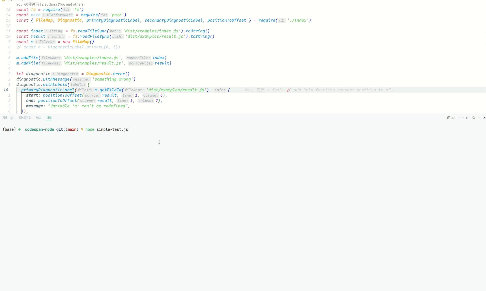

# `codespan-napi`


> codespan-reporting node binding powered by napi-rs

## Installation 

```
yarn add codespan-napi
```

## Features
1. You could see an equivalent example to https://github.com/brendanzab/codespan readme here [examples/simple.js](examples/simple.js)
2. [Save diagnostic message as svg](examples/generateSvg.js), the preview svg is generated by the example

3. [Diagnostic cross multiple file](examples/multiple.js)

4. Jump to error code from terminal
   

## Support matrix

### Operating Systems

|                  | node12 | node14 | node16 |
| ---------------- | ------ | ------ | ------ |
| Windows x64      | ✓      | ✓      | ✓      |
| Windows x32      | ✓      | ✓      | ✓      |
| Windows arm64    | ✓      | ✓      | ✓      |
| macOS x64        | ✓      | ✓      | ✓      |
| macOS arm64      | ✓      | ✓      | ✓      |
| Linux x64 gnu    | ✓      | ✓      | ✓      |
| Linux x64 musl   | ✓      | ✓      | ✓      |
| Linux arm gnu    | ✓      | ✓      | ✓      |
| Linux arm64 gnu  | ✓      | ✓      | ✓      |
| Linux arm64 musl | ✓      | ✓      | ✓      |
| Android arm64    | ✓      | ✓      | ✓      |
| Android armv7    | ✓      | ✓      | ✓      |
| FreeBSD x64      | ✓      | ✓      | ✓      |

## Ability

### Build

After `yarn build/npm run build` command, you can see `package-template.[darwin|win32|linux].node` file in project root. This is the native addon built from [lib.rs](./src/lib.rs).

### Test

With [ava](https://github.com/avajs/ava), run `yarn test/npm run test` to testing native addon. You can also switch to another testing framework if you want.

## Develop requirements

- Install latest `Rust`
- Install `Node.js@10+` which fully supported `Node-API`
- Install `yarn@1.x`

## Test in local

- yarn
- yarn build
- yarn test

And you will see:

```bash
$ ava --verbose

  ✔ sync function from native code
  ✔ sleep function from native code (201ms)
  ─

  2 tests passed
✨  Done in 1.12s.
```
